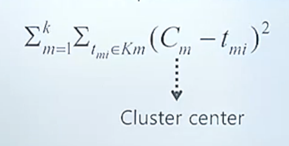
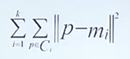

# 빅데이터 (1)

## | Clustering 이란?

\- 데이터와 원하는 그룹의 개수 k라는 파라미터가 있을때 데이터를 유사도에 의해서 k개의 그룹으로 나누는 것을 말함.

즉, 데이터의 유사도에 의해서 고객들을 그룹핑 하는 것임

예를 들어, 웹툰이 1, 2, 3, 4, 5, 6 이 있을 때

웹툽 1, 2, 3 을 보는 사람, 4, 5, 6 을 보는 사람 그룹으로 나누어서

4, 6, 을 읽은 사람은 두 번째 그룹으로 들어가고, 5를 추천받을 수 있는거임!

## | Applications of Clustering

\- 백화점 고객을 구매 상품에 따라서 클러스터링함

\- 추천 시스템에 의해 고객의 과거 패턴을 이용해서 클러스터링

\- Gene 데이터를 유사도에 따라서 클러스터링함

\- 경영진이 정책을 결정하는데 쓰임

등등

엄청 많은 가짓수의 클러스터링 결과들이 가능한데, (어떤 기준에 따라 나누냐에 따라) 빅데이터가 되면 일일이 나누는 기준을 다 해볼 시간이 안됨 

(부분집합 개수: n개의 데이터면 2^n 만큼의 경우의 수가 나옴)

k개 클러스터가 있다면 이런 식을 사용함.

**# godness  measure**

모든 포인트마다 센터(평균)포인트의 차이를 제곱해서 더함

클러스터링에 여러 결과가 있을때 얼마나 좋은지 판단하는 기준으로 씀!

## | partitions algorithm

메져가 좋은 알고리즘을 말함. 다 가 아니고 일부만 뒤지면서 결과를 찾아가는거임!

###  1) K-means Clustering

 means는 평균점. k개의 평균점. 이라는 뜻

처음에 random 하게 그룹핑함. 각 디멘션 더하고 갯수를 나눠서 클러스터링함.

어느 센터, 어느 평균점에 가까운지 각각 다 assign을 함

다시 이 상태에서 또 평균점을 계산해서, 각각 포인트를 보면서 가까운 center에 assign 하게됨. 결과가 같으면 stop하게 되는거임!!

몇번을 거쳐서 찾고, 가장 좋은 점을 찾음!

**# 단점:** 

\- 클러스터의 사이즈가 너무 크거나 작으면 찾기 어려움

\- 공 같은 3-디멘션의 클러스터만 잘 찾을 수 있음

\- 클러스터에서 아주 먼 애가 있게되면 outine 쪽에 끌려가서 실제 데이터가 없는 쪽의 데이터를 평균점으로 계산하게됨

\- 이를 보완한 것이

   K-Medoids : 실제 있는 포인트들에 대해서 평균점을 도출해냄!

****

### 2) Hierarchical Clustering

Top down, Bottom up 방식이 있는데, 후자가 더 많이 이용된다

모든 포인트가(n개) 인디펜더라는 클러스터인데 모든 쌍들에 대해 거리를 계산해서 거리가 제일 가까운 페어 두개를 찾아 걔네를 머지해서 하나의 클러스터를 만들면 클러스터의 개수가 하나 줄어듬(n-1개). 또 페어와이즈로 모든 거리를 계산해서 가장 가까운걸 매번 하나씩 머지해가는거임. k개가 되면 stop.

즉, k개가 될 때까지 merge 해 내가는 방식!

Average-Link, Mean-Link, Centroid-Link 가 있음

Single Link, Complete Link(어느정도 그룹 사이즈가 되면 4개로 나눔)도 있음

이렇게 어떤 Distance Function을 쓰느냐에 따라 결과가 달라지게 된다!

### 3) DBSCAN Clustering Algorithms

Density-Based 라는 뜻. 다음 두 파라미터가 있음

Eps(입실론): Maximum raduis of the neighbourhood

Minpts: Minimum number of points in an Eps-neighbourhood of that point

어떤 점 하나가 있으면, NepsP 라고 함. P로부터 eps 거리안의 점들

Number of Point 가 Min.N.P 이상이면 코어포인트, 아니면 보더포인트 라고함

**# Density-reachable** : q, p1, p 가 있을때

q 와 p1 사이에 입실론 네이버후드 미니멈 개수를 만족하고 p1이 네이버후드면

q-p1 이고

p1 과 p 사이에 입실론 네이버후드 미니멈 개수를 만족하고 p가 네이버후드면

p1-p 이기에

q 와 p 는 Density-reachable 한것임!

몇 번에 걸치든지, Minpts가 맞으면 됨!

**# Density-connected**: o 라는 점이 p, q 둘다 density reachable 인 경우를 말함

\# Density Clustering 은 두 가지 프로퍼티를 만족해야함

1) Maximality: 데이터에 있는 임의의 pi, pj가 있을때, pi가 C라는 클러스터에 속했으면 pj도 C에 속해야함 (둘다 C에 density reachable 해야한다는 뜻)

2)Connectivity:  데이터에 있는 임의의 pi, pj가 있을때, 둘 다 C와 density-connected 여야 한다

\# 그래서 DBSCAN은 입실론, MinPts 주어지고 계산하는것임. 

입실론 바운더리 안 네이버후드 갯수 보면서 같은 클래스로 묶음.

MinPts를 만족하지 않으면 클러스터가 늘어나지 않음!

이는 visited, unvisited로 분류함. 모두 다 볼때까지 unvisited를 찾음

## | EM Clustering

\- Generative model (생성 모델)

   : 모델에 의해서 데이터가 랜덤하게 제너레이트 되어서 만들어져있다고 보는것

빨간 공 4개가 들어있는 주머니(선택될 확률:2), 빨간공3개 파란공1개가 있는 주머니(선택될 확률:1) 이 있다고 가정해보자. 새 주머니에 공을 뽑아서 넣었을때, 결과를 보고 모델을 추측해보자. 몇대 몇의 비율로 주머니에 무슨 공이 있었을까? 를 찾는게 모델을 찾는 과정이라고 생각하면 됨.

결과 데이터를 보고 확률적으로 계산했을때(다 곱합) Total probability of having the observable data가 나옴

여러가지 가능성이 있는데, 내가 갖고 있는 데이터를 생성했을 확률이 제일 높은애를 Likelyhood라 하는데 그게 제일 높은 모델을 선택하겠다는 것

이게 Probabilist Modeling!! -> 클러스터링이나 추천 같은거 할 때 쓸 수 있음

## | EM Algorithm

Maximum Likelyhood 식을 파라미터로 미분해서 0으로 놓아서 찾음

식들이 Cycle이 있어서 단계적으로 계산할 수 있음

random 하게 파라미터 세팅해서 converge하게 되면  stop 하고

파라미터 최종값을 찾음!

즉, 역으로 생성 모델을 찾아가는 알고리즘이다

파라미터 3개를 찾는건데, 파라미터들은 평균점, 표준편차, 봉우리가 선택될 확률

봉우리 k개, 각각의 봉우리마다 3k 가 있음

EM Clustering의 강점 (제대로 Clustering 해주는 알고리즘은 이것 뿐이다)

: 생성 모델을 만듦 -> 생성 모델의 파라미터를 찾음 -> 확률을 계산 -> 확률값의 포인트마다 가장 확률이 높은 Cluster에 속한다고 봤을때 그래프가 원하는대로 분류됨! Linke 종류에 따라 결과가 다른데, EM Clustering만 가장 정확하게 됨!
