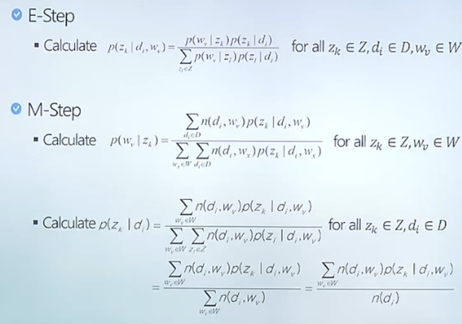
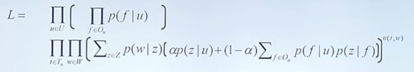
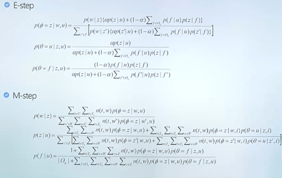
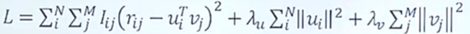
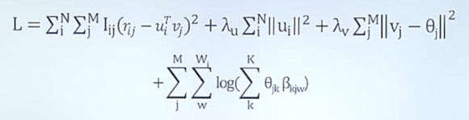

# 빅데이터 (2)

## PLSI(Probabilistic Latent Semantic Indexing)

 EM Clustering 보다 조금 더 복잡한 방식이다.

앞에서는 데이터가 있으면 클러스터가 바로 결정되는데,

내가 문서를 쓴 거를 가지고 모델링을 함

k개의 주제가 있어서 문서를 주제별로 클러스팅함

1) 주제를 하나 선택

: k개의 주제가 있는데, 사람별로 어떤 주제를 쓸지 확률을 구함

(앞에서 봉우리 선택하는 것과 같은 논리)

모든 주제마다 확률이 다 다르게 책정됨.

2) 다시 또 주제를 선택

그 주제하의 단어 확률 분포를 또 분석

3) 다시 또 주제를 선택

단어에 대한 확률 분포를 보고 또 random 하게 선택

이러한 과정을 거쳐 주제를 선택하고,  그 중에 확률 분포에 의해 단어가 random 하게 하나 선택되고 그게 내가 가지고 있는 제너레이트 모델이라 생각하는 것임

여기도 Likelyhood가 있음. 

E-step 으로 M-step 계산하고, 역방향으로도 계산하고 랜덤한 값으로 서로를 계산

이러면 어느순간 converge 되는데, 그 순간 얘네들을 파라미터로 보겠다는 것임!

**# 결론**

어떤 문서에 어떤 단어가 있는지 사실만 가지고, k개의 **주제**가 있다고 가정한 후 생성 모델을 만들어서 이런 파라미터들을 찾아서 하는 방법!

## TWITOBI

트위터에서는 내가 팔로우한 사람이 쓴 글의 주제도 쓸 수 있음!

같은 원리로,  TWITOBI도 이런식으로 조금 더 복잡함

예를 들어서, 팔로우 할 만한 사람, 또는 다른 사람에게 쓴 메세지 중에서 가장 그 사람에게 어울리는 글 등을 추천해줄 수 있게됨

주제가 선택되면 그 주제 하에서 어떤 단어들이 선택될지의 확률 분포가 있음

트위터 데이터 모델링!

필요한 파라미터: 사람들마다 팔로우할 확률, 유저가 자기 주제를 선택할 확률(알파), 팔로우하는 사람들이 주제를 선택할 확률(1-알파)

이러한 모델링을 가지고 이전에 학습한 내용들을 기반으로 알고리즘을 돌림!

Liklyhood (모든 트윗 메세지마다 글이 써지는 것)

똑같은 과정으로 step 단계로 계산하고 conversion stop하고 파라미터 정함!

## 추천 시스템

Recommendation System 에는 크게 두 가지가 있다.

#### 1) Content based filtering method

\- item 마다 actual content를 이용함 (유사도 기반)

#### 2) Collaborative filterting method

\- User 마다 직접 점수를 매긴 iterm 들에 대한 rating을 이용해서 추천

(각각의 유저는 비슷한 다른 유저들과 동일하게 행동한다는 가정. 서로 영향 끼침)

이를 하기 위한 두 가지 방법은

(1) Memory based method

\- 과거의 rating 에 base해서 추천 (지금까지 유저의 누적 데이터를 기반으로)

(2) Model based method

\- 데이터를 가지고 모델을 만든 다음에 모델을 기반으로 추천

\* 영화 추천을 하는 것으로는 **Matrix Factorization**이 있다

(영화 평점 matrix 이용. 모든 평점 데이터가 다 있는게 아니지만 유사 데이터로 추측해서 채움)

i번째 user가 j번째 영화를 본 rating (예상 평점 찾기)

봤으면 1 안봤으면 0 해서 데이터화 시켜서 차이가 적은 애들을 찾아냄

요즘은 평점 말고도, 줄거리 장르 등을 활용해 다른 모델(PLSI)로 주제를 찾고 이 매트리스에 쓰는데 도입함

그래서 Likelihood 가 다음과 같아짐

