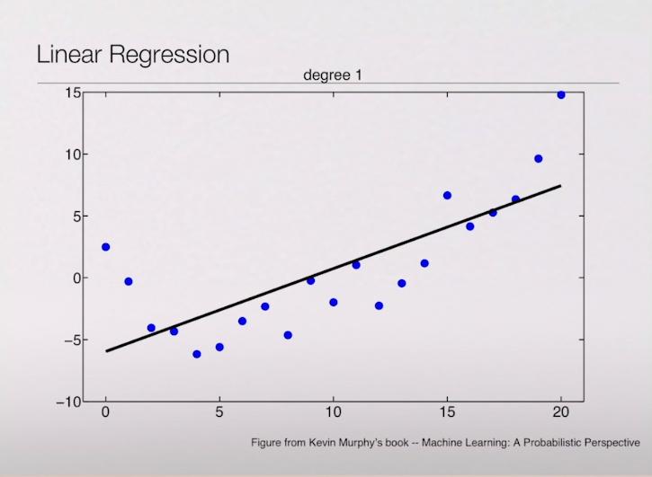
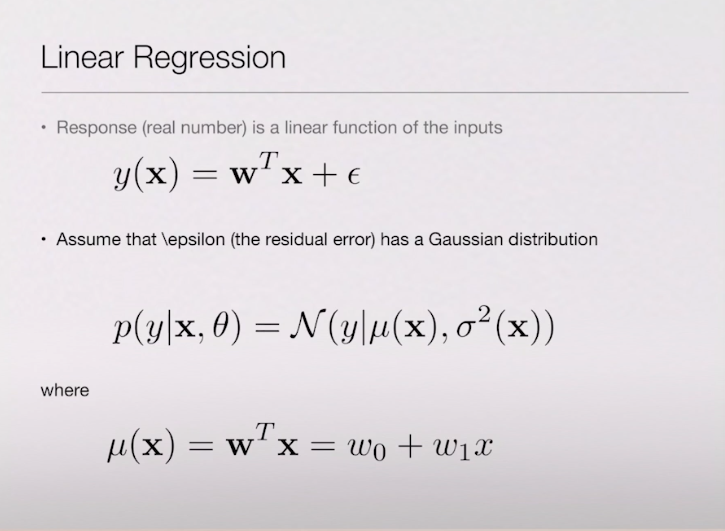
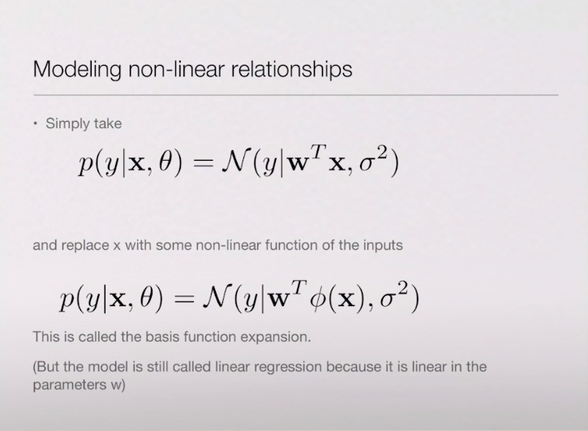
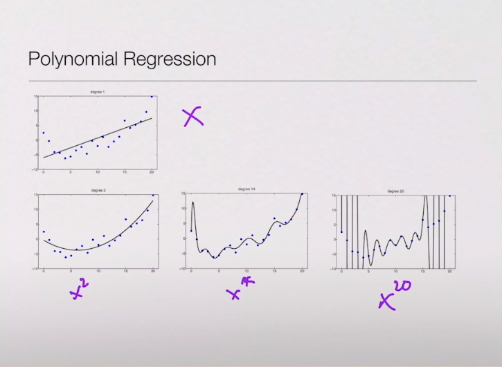
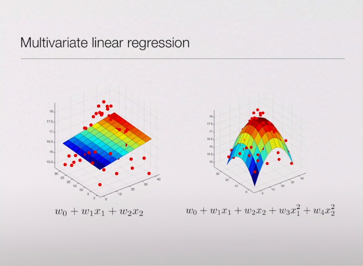
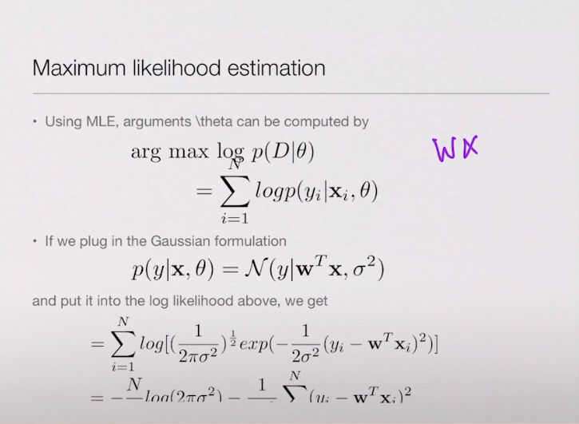
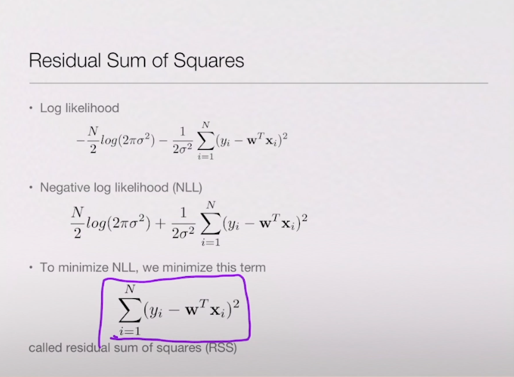
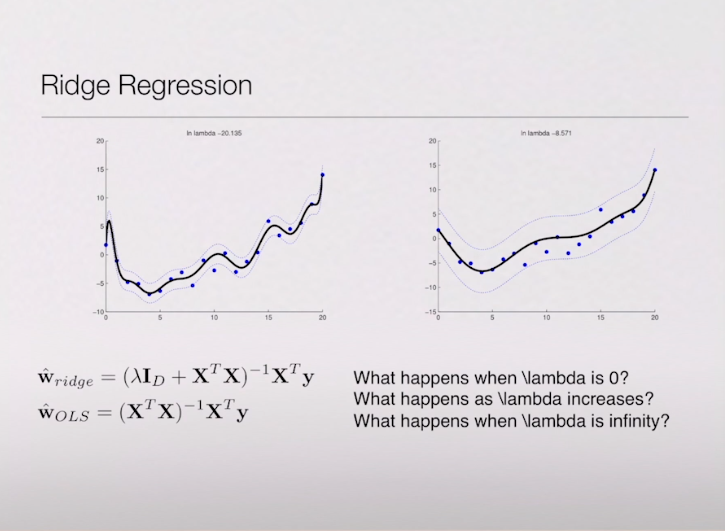

# Day10 인공지능(2) | 2020. 03. 20

## Linear Regression

* 지도학습, 비지도학습,  representation learning, 강화학습 중에서 지도학습에 해당된다. 
* 지도학습 중에 많은 부분은 Regression 형태로 한다. 
* 주어진 x 에 대해서 y 값을 실수로 예측하는 것이 Regression Problem이다. 
  * 분류와의 차이점 : 데이터가 주어졌을 때 원하는 결과값이 class 를 선택하는 것이 아니라 실수로 3.5 와 같이 값을 내준다. 
  * 예: 집 평수에 따라서 가격이 주어지는데, 가격을 예측을 할 때에도 regression 을 사용할 수 있다. 

### Linear Regression

*  Linear Regression 은 Regression 중 가장 간단한 방법으로 프로젝트에서 사용할 가능성이 높다. 

  

* x 값이 주어졌을 때 y값을 예측할 수 있도록 라인을 그려준다. 
* 주어진 데이터에 대해서는 y값을 알고 있다. 
* 데이터에 대해서 그릴 수 있는 선이 무한대로 많다.

### 수식

1. Linear Regression 수식

* x 에 대해서 무엇인가를 곱해준다. 
* `w` : 라인의 식을 나타내는 것 
  * 어떠한 라인이 데이터에 적합한 것인지 판별할 수 있다. 

2. Non-Linear Regression 수식

* 선형적인 관계가 아닐 수도 있다. 
* 비선형적인 fuction 을 넣어준다. 

3. Polynomial Regression

* 데이터에 대해서 설명이 잘되어 예측을 더 잘하게 해준다. 

###  Multivariate linear regression

* x1과 x2 의 조합으로 y를 예측할 수 있다. 
* 다양한 형태가 나온다는 것 

수식

#### RSS

* 가지고 있는 데이터에 대해서 실제 y 값과 이 선으로 예측되는 y 값의 차이가 얼마인지 알려준다.
* 제곱을 하는 이유는? 수학적으로 수식을 쉽게 계산하기 위해서 
* 차이를 줄이는 W 를 찾기 위해서 RSS 를 사용한다.

* 왼쪽 그래프: 적합한 regression 을 찾은 그래프 
* 오른쪽 그래프 : W 의 패널티를 큰 값을 주었을 때 좀더 부드러운 형태가 나온다. 

* 모든 데이터에서 regression 이 중요하다. 

