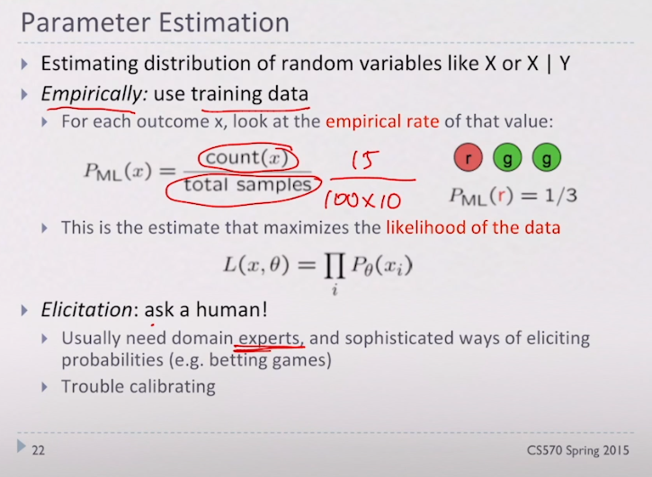

# Day10 인공지능(3) | 2020. 03. 20

 ## Naive Bayes classifier

머신러닝 연구, 실제 응용 상황에서 기본 모형으로 사용한다. 

모든 나이브 베이즈 분류기는 공통적으로 모든 특성 값은 서로 독립임을 가정한다. 분류 가능하게 하는 특성들은 나이브 베이즈 분류기에서 특성들 사이에서 발생할 수 있는 연관성이 없음을 가정하고 각각의 특성들이 특정 과일이 사과일 확률에 독립적으로 기여 하는 것으로 간주한다.

### 1. Features

* 성질, 데이터에 대한 디테일 
* 분류하고자 하는 데이터에 대해서 컴퓨터가 분류하기 위해 숫자로 데이터를 변환해주는 것

### 2. Navie Bayes for Digits

#### Q. 숫자 3을 어떻게 분류할 것인가 

* feature 를 생각해야한다. 
  * 각각의 픽셀을 통해서 feature 를 파악한다. 
  * 데이터를 feature 화 한다. 

* 수식을 통해 계산하면 숫자 3인지를 알 수가 있다. 
* Y : class
* Fij : 데이터의 값
* P(Y) : class 에 대한 확률 / 큰 의미가 있지는 않다. 

1. Empirically
2. 전문가에게 문의 
   * 예를 들어, 의료 관련 데이터의 경우 
   * 데이터가 없어도 가능할 수 있다. 

#### Q. A Spam Filter

* Y: 스팸인지 아닌지 

* CPT

  * 스팸일 때, "Free" 라는 단어가 나올 확률 /
  * 스팸이 아닐 때, "Hello" 라는 단어가 나올 확률

  

#### Bag-fo-Words

* count: frequency 빈도 (몇 번이나 나왔는지) 가 중요하다 

* 단어가 어떠한 문맥에서 나왔는지 중요하다. 이전의 단어가 무엇인지. 
  * BUT, Naive Bayes 모형은 word order 를 고려하지 않는다. 
  * 이를 대신에 사용하는 것이 Bag-fo-Words 
* 모델이 간단하기 때문에 사용한다. (복잡한 모델일 경우 사용하지 않는다.)

#### Laplace Smoothing

* Bag-fo-Words 의 문제점을 보완하기 위해 사용

* 새로운 단어가 나오더라도 해당 빈도에 +1을 해줌으로써 확률이 0이 되는 것을 막는다.

  
